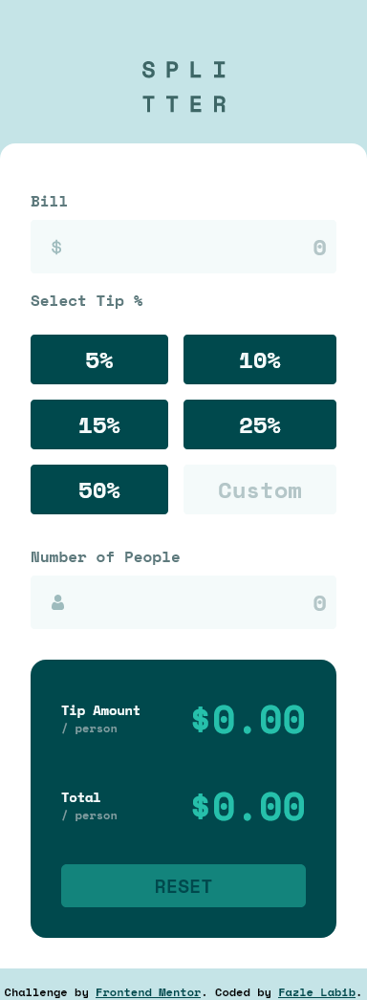

# Frontend Mentor - Tip calculator app solution

This is a solution to the [Tip calculator app challenge on Frontend Mentor](https://www.frontendmentor.io/challenges/tip-calculator-app-ugJNGbJUX). Frontend Mentor challenges help you improve your coding skills by building realistic projects.

## Table of contents

- [Overview](#overview)
  - [The challenge](#the-challenge)
  - [Screenshot](#screenshot)
  - [Links](#links)
- [My process](#my-process)
  - [Built with](#built-with)
  - [What I learned](#what-i-learned)
- [Author](#author)

## Overview

### The challenge

Users should be able to:

- View the optimal layout for the app depending on their device's screen size
- See hover states for all interactive elements on the page
- Calculate the correct tip and total cost of the bill per person

### Screenshot




### Links

- Solution URL: [https://github.com/FazleLabib/frontend-mentor-tip-calculator-app](https://github.com/FazleLabib/frontend-mentor-tip-calculator-app)
- Live Site URL: [https://fazlelabib.github.io/frontend-mentor-tip-calculator-app](https://fazlelabib.github.io/frontend-mentor-tip-calculator-app)

## My process

### Built with

- Semantic HTML5 markup
- CSS custom properties
- Flexbox
- CSS Grid
- Mobile-first workflow
- JavaScript

### What I learned

Got some practice on how to deal with input elements without having to click any buttons or other elements. Gained more knowledge on how CSS Grids work. Figured out how to make radio inputs and text inputs work together.

<!-- ```html
<h1>Some HTML code I'm proud of</h1>
```
```css
.proud-of-this-css {
  color: papayawhip;
}
```
```js
const proudOfThisFunc = () => {
  console.log('🎉')
}
``` -->

## Author

- Frontend Mentor - [@FazleLabib](https://www.frontendmentor.io/profile/FazleLabib)
